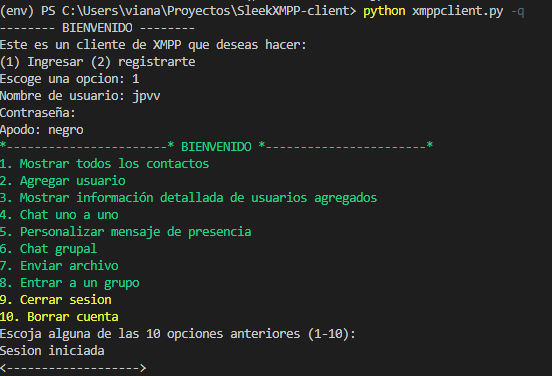

# SleekXMPP-client
Proyecto individual de redes 2020. Consiste en desarrollar un cliente que utilice el protocolo XMPP y se comunique a través de un servidor (redes2020.xyz) con los demás clientes desarrollados por compañeros de clase.

<p align="center">

</p>

<p align="center">

</p>

## Instalacion

```bash
pip install -r requirements.txt
```

```bash
python xmppclient.py -q
```

* -q para correr en modo silecio
* -d para correr en modo DEBUG

## Funcionalidades
- [x] Ver todos los usuarios
- [x] Agregar usuario
- [x] Ver detalles de contactos agregados
- [x] Borrar cuenta
- [x] Cerrar sesión
- [x] Envio y personalizacion de mensajes de presencia 
- [x] Enviar un archivo
- [ ] Unirse a un grupo